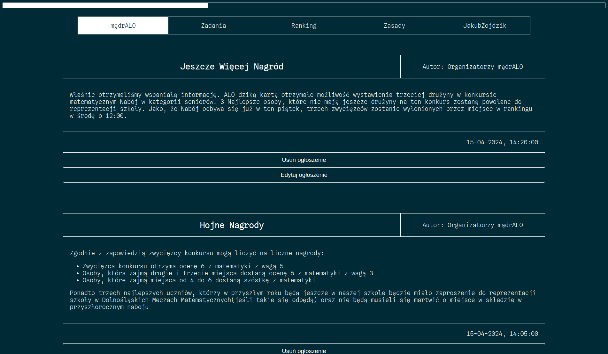
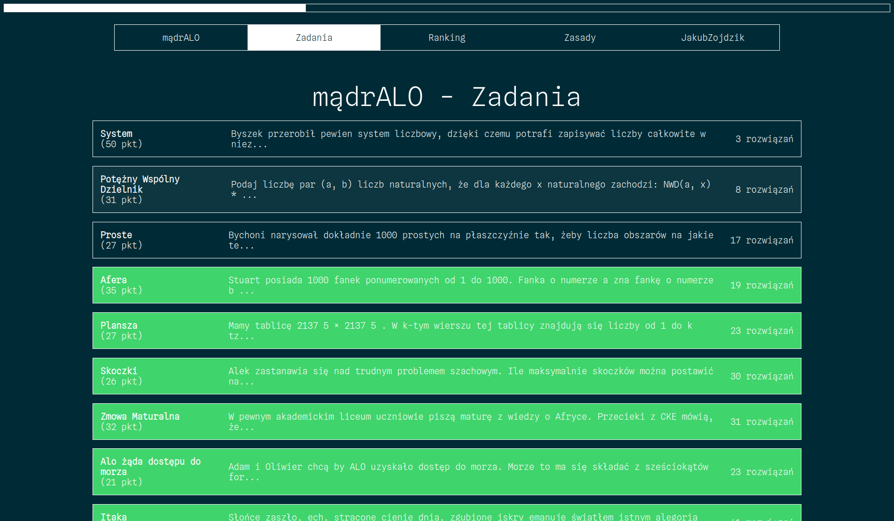
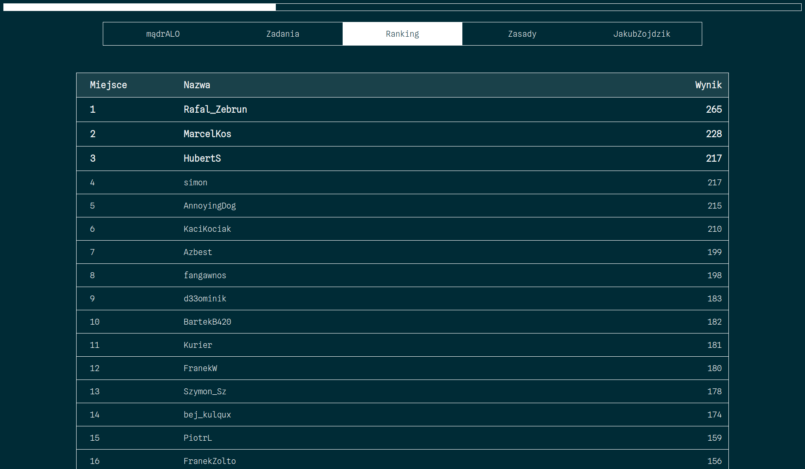
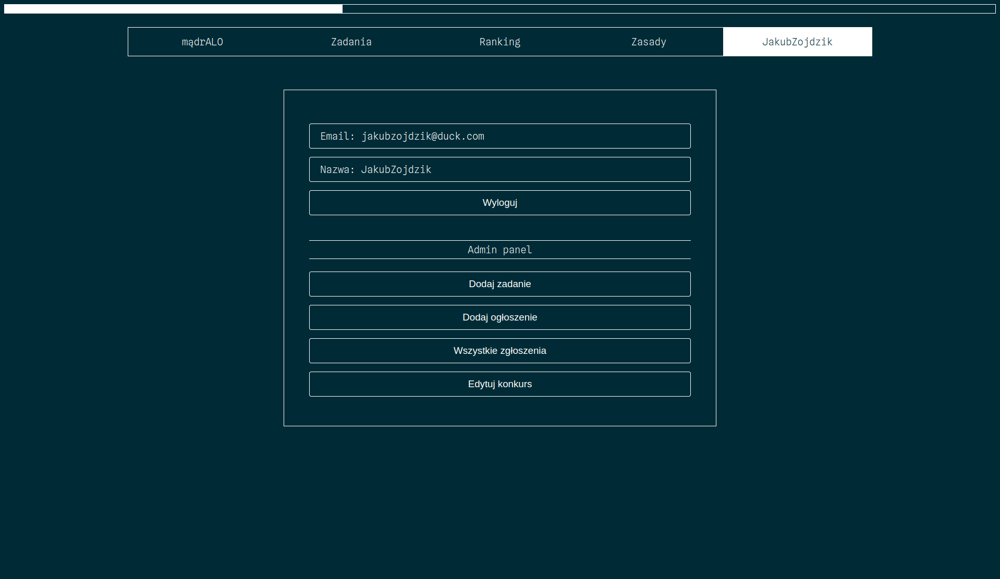
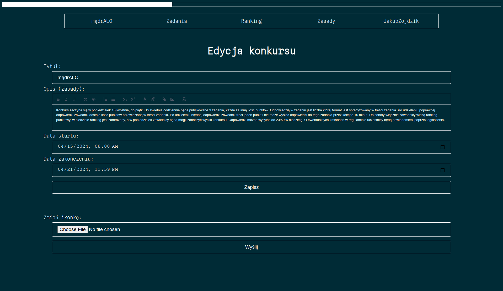
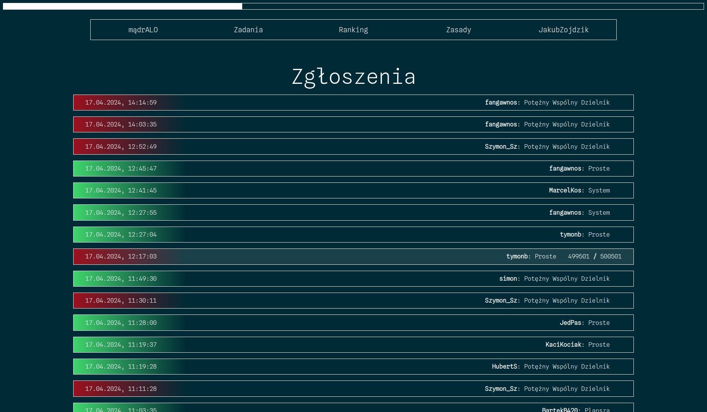

# SOK Client

The SOK Client is a web application that serves as a client for the competition system. It provides a user-friendly interface to create challenges, make announcements, solve challenges, and earn points. Additionally, it offers features like viewing the ranking list and user submissions. The client is built using Vue.js and Vite.

## Features

-   **Challenge Creation:** Create challenges easily using the intuitive interface.
-   **Announcements:** Make announcements to keep participants informed.
-   **Challenge Solving:** Solve challenges and earn points.
-   **Ranking List:** View the ranking list to see how you compare to other participants.
-   **User Submissions:** Check user submissions and their progress.

## Getting Started

To run the SOK Client, you'll need to set up the necessary environment variable:

1. Create a `.env` file in the root directory of the project.
2. Add the following variable to the `.env` file:

    ```env
    VITE_APP_API_URL=<API_URL_HERE>
    ```

    Replace `<API_URL_HERE>` with the URL of the API server.

## Running with docker

The SOK Client includes a Dockerfile and a Docker Compose configuration for easy deployment. To run the client using docker-compose, follow these steps:

1. Make sure you have Docker and Docker Compose installed on your system.
2. Clone this repository to your local machine:
    ```sh
    git clone https://github.com/JakubZojdzik/SOK-client.git
    ```
3. Navigate to the project directory:
    ```sh
    cd SOK-client
    ```
4. Create a .env file in the root directory of the project and set the required environment variable as described above.
5. Start the SOK Client in detached mode:
    ```sh
    docker-compose up -d
    ```

The client will be accessible at `http://localhost:8080`.

## SOK API

You can find API for this project in [this repository](https://github.com/JakubZojdzik/SOK-api)

## License

This project is open-source and available under the [MIT License](LICENSE).

## Contributing

If you find a bug or have an idea for an improvement, please create an issue or submit a pull request.

## Screenshots











